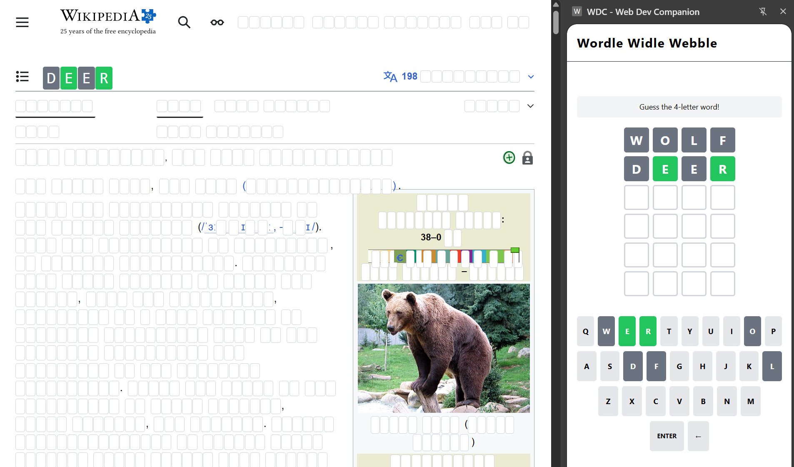
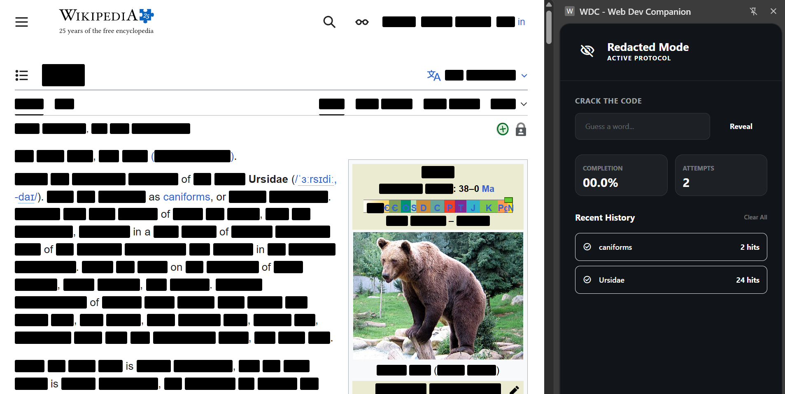
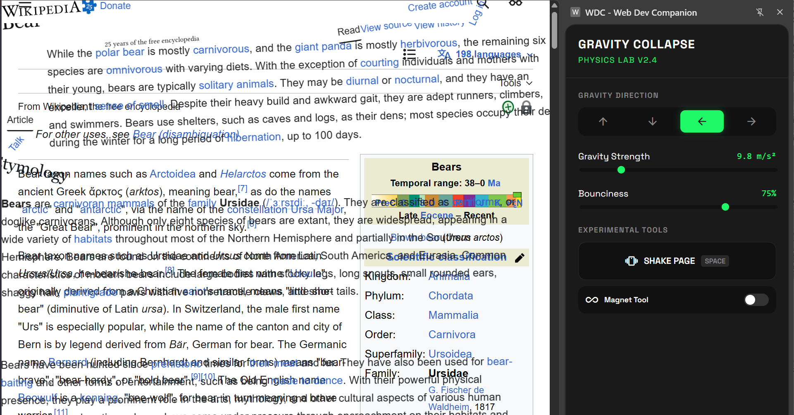

# WDC Tools

## What

WDC Tools is a Chrome extension made in four hours for the [Web Dev Challenge S3 E1](https://www.youtube.com/watch?v=BP48Y9JiMUo).

It contains three modes that can be applied to play with any website:

### Wordle Widle Webble

Transforms every single word on any website into its own Wordle puzzle.

### Redactle

Hides every word longer than two letters on a page. Guess words correctly to un-redact them.

### Gravity Collapse

Gives many elements on the page "physics" and applies "gravity" to make them tumble around the screen.

## How

- Clone the project, or download the ZIP and extract the files.
- In Chrome: `Extensions > Manage Extensions` (or navigate to `chrome://extensions/`)
- Click `Load unpacked` and select the root folder of this project.
- Open any website, select the extension icon (generally a puzzle icon next to the search bar) and select "WDC Tools".
- Select one of the three modes and play around with any website!

You may have to grant permissions to the extension before use.

## Who

The [Bears of Destiny](https://open.spotify.com/track/3DN6TlK8mms6tXUvaOlZ7G?si=a777e2c4cee9480d) are [Ben Nelson](https://www.linkedin.com/in/ben-nelson-951a24a8/) and [Tyler Dawson](https://tylerdawson.dev), with special guest star [Google Jules](https://jules.google.com/).
